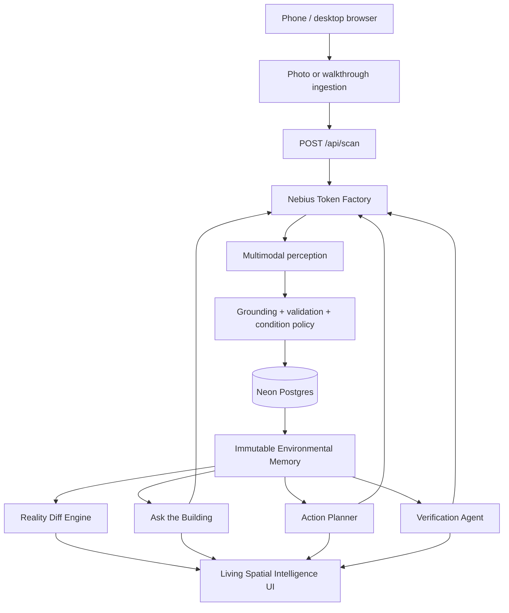

# SENTINEL — AI Memory for the Physical World

> **Scan a physical environment. SENTINEL remembers what was there, reasons over grounded evidence, shows what changed, recommends what to do next, and verifies the result.**

Built for the **Nebius × NVIDIA Global AI Hackathon 2026**.

**Track:** Best Apps and Agents  
**Live demo:** https://sentinel-physical-memory.vercel.app  
**License:** MIT

## What SENTINEL is

Most software remembers documents, databases, websites, and API events. Physical spaces usually do not have the same kind of queryable history.

SENTINEL turns photos and walkthroughs into persistent environmental memory:

```text
OBSERVE → UNDERSTAND → REMEMBER → ASK → REASON → ACT → RESCAN → VERIFY
```

Each observation creates an immutable environmental state. Later observations are compared with remembered state so SENTINEL can answer questions such as:

- What needs my attention?
- Where is an object I saw before?
- What changed since the last scan?
- Which change matters most?
- What should I do?
- Has the condition actually been resolved?

The product is intentionally evidence-first. A condition disappearing from a later model response is **not** treated as proof of resolution.

## The problem

Operational knowledge about physical environments is usually fragmented across camera rolls, inspection notes, spreadsheets, chat messages, and human memory.

That creates three gaps:

1. **No persistent machine-readable memory** of what a place looked like over time.
2. **No trustworthy temporal diff** between environmental states.
3. **No closed loop** connecting detection, reasoning, recommended action, re-observation, and verification.

SENTINEL treats a physical environment more like a versioned system.

## Why it is different

SENTINEL is not a generic image analyser, inspection form, or detached chatbot.

Its core primitive is **persistent environmental state**:

- observations are grounded to evidence;
- states are immutable once remembered;
- Reality Diff compares state to state;
- Ask reasons over remembered history rather than one image;
- Action Planner is recommendation-only;
- Verification requires positive current evidence;
- uncertainty is preserved instead of converted into a cleaner-looking answer.

The signature idea is **Reality Diff — a Git diff for the physical world.**

## Product experience

The primary product areas are deliberately small:

- **Memory** — what this place remembers.
- **Observe** — capture a new grounded physical state.
- **Changes** — Reality Diff between remembered states.
- **Ask** — contextual intelligence available across the environment.

The visual rule is:

> **Dark = SENTINEL is looking.**  
> **Light = SENTINEL is remembering.**

Personality:

> **Quiet. Alive. Precise.**

## How it works

### 1. Observe

A user captures or uploads a photo or walkthrough. Browser-side ingestion resizes/compresses evidence and limits frame count before sending it to the backend.

### 2. Understand

The perception pipeline extracts evidence-grounded:

- objects/assets;
- environmental conditions;
- locations/positions;
- relationships;
- confidence;
- observations.

### 3. Remember

SENTINEL persists environmental memory in **Neon Postgres**. Each scan creates a new immutable state snapshot rather than rewriting what an older state believed.

### 4. Compare

The deterministic Environmental Diff Engine compares two immutable snapshots and can represent:

- Added;
- Removed;
- Moved;
- Changed;
- Resolved;
- Needs verification / uncertain.

Low-salience inventory churn is filtered from the headline Reality Diff without deleting immutable history.

### 5. Ask and reason

Ask the Building sends a bounded, server-owned grounding envelope to the reasoning model. Model-returned evidence/object/issue IDs are validated against that envelope before display.

### 6. Recommend action

Action Planner creates small evidence-backed **Recommended** steps. It does not claim work happened and does not execute purchases, contractor hiring, or repairs.

### 7. Verify

After a new observation, the Verification Agent compares previous and current state. A condition becomes **Verified / resolved** only when positive current evidence supports the physical outcome.

Core trust rule:

> **Not re-observed is not resolved.**

## Architecture



Detailed architecture: [docs/ARCHITECTURE.md](docs/ARCHITECTURE.md)

## NVIDIA + Nebius usage

SENTINEL makes real runtime inference calls through **Nebius Token Factory**.

| Responsibility | Runtime role | Default model |
| --- | --- | --- |
| Scene perception / evidence extraction | `perception` | `openbmb/MiniCPM-V-4_5` |
| Paired temporal object verification | `temporal-verification` | `openbmb/MiniCPM-V-4_5` |
| Ask the Building reasoning / prioritization | `reasoning` | `nvidia/NVIDIA-Nemotron-3-Nano-30B-A3B` |
| Action Planner | `action` | `nvidia/NVIDIA-Nemotron-3-Nano-30B-A3B` |
| Physical condition verification | `verification` | configured verification model, falling back to the perception model |

**NVIDIA Nemotron 3 Nano 30B-A3B** is therefore on the critical reasoning and action-planning path, not a decorative chat layer.

Every Token Factory completion emits non-secret runtime telemetry:

- provider;
- model;
- request role;
- latency;
- outcome;
- completion timestamp;
- HTTP status or safe error code.

Successful Scan, Ask, Action Plan, and Verification responses include their request-local `inference` trace. `GET /api/health` exposes the non-secret role → model map and exact deployment commit.

Canonical implementation record: [Knowledge/Technical/phase-16-nebius-nvidia-architecture.md](Knowledge/Technical/phase-16-nebius-nvidia-architecture.md)

## Technology

- React
- TypeScript
- Vite
- Vercel serverless functions
- Neon Postgres
- Nebius Token Factory
- NVIDIA Nemotron 3 Nano 30B-A3B
- MiniCPM-V for multimodal perception
- deterministic state/diff/grounding policies around model output

## API surface

| Route | Purpose |
| --- | --- |
| `GET /api/health` | Runtime, persistence, deployment and non-secret AI architecture diagnostics |
| `GET /api/memory?environmentId=...` | Restore persistent environmental memory |
| `GET /api/states?environmentId=...` | Immutable state-history navigation |
| `POST /api/scan` | Ground a new observation and create the next state |
| `POST /api/ask-building` | Evidence-grounded reasoning over memory |
| `POST /api/action-plan` | Recommended evidence-backed next steps |
| `POST /api/verify` | Compare prior condition with current physical evidence |

## Local setup

### Requirements

- Node.js **22.x**
- npm
- Nebius Token Factory API key
- a Postgres connection string for persistent memory (Neon is used in production)

### Install

```bash
git clone https://github.com/realxpen/sentinel-physical-memory.git
cd sentinel-physical-memory
npm install
cp .env.example .env.local
```

Fill the required server-side values in `.env.local`:

```bash
NEBIUS_API_KEY=...
DATABASE_URL=...
```

The default model configuration is already documented in `.env.example`. Never put server secrets in `VITE_*` variables.

### Run

```bash
npm run dev:local
```

Then open the local Vite URL shown in the terminal.

### Build

```bash
npm run build
```

### Core verification gates

```bash
npm run check:phase14-demo
npm run check:phase15-reliability
npm run check:phase15-routes
npm run check:phase15-stability
npm run check:phase16-telemetry
```

The repository contains additional phase-specific regression gates used by Sentinel CI.

## Judge testing

No account or paid subscription is required to use the hosted demo.

Start here:

**https://sentinel-physical-memory.vercel.app**

Recommended quick test:

1. Create a new location.
2. Upload a clear baseline photo of a room/hallway.
3. Change one obvious physical object or add an obstruction.
4. Upload the second photo.
5. Open **Changes** and inspect Reality Diff.
6. Ask **“What changed since the last scan?”**
7. Ask **“What should I do?”** when a grounded actionable condition exists.
8. Correct the physical condition and upload a new photo.
9. Use Verification to confirm the result.

Full testing guide: [docs/JUDGE_TESTING.md](docs/JUDGE_TESTING.md)

## Canonical demo scenario

The controlled hackathon story is:

```text
Scan A
clear exit + extinguisher at position A
        ↓
Scan B
boxes obstruct exit + extinguisher moved
        ↓
Reality Diff
obstruction / movement / attention
        ↓
Ask
Which change matters most?
        ↓
Action Plan
evidence-backed recommended steps
        ↓
Scan C
boxes removed
        ↓
Verification
Verified — exit path clear from positive current evidence
```

Detailed rehearsal guide: [docs/DEMO_SCENARIO.md](docs/DEMO_SCENARIO.md)

## Reliability and guardrails

SENTINEL explicitly handles failure cases including:

- zero grounded output;
- poor or duplicate-heavy video;
- invalid provider JSON/schema;
- transient inference timeout;
- missing evidence;
- missing historical state/snapshot;
- wrong environment/source identity;
- no material change;
- oversized request bodies;
- network interruption;
- duplicate semantic conditions;
- conflicting model verdicts;
- reload/cold start from server-authoritative Neon memory.

The system fails closed rather than fabricating a result for a smoother UI.

## Limitations

- Visual perception can be wrong or incomplete.
- SENTINEL is not a professional engineering, fire-safety, electrical, structural, or regulatory certification system.
- A single camera viewpoint may not contain enough evidence to verify a condition.
- Object identity can become uncertain under large viewpoint changes or severe occlusion.
- Current spatial memory is evidence-derived rather than a metric 3D reconstruction.
- Inference latency depends on model/runtime availability.
- Recommended actions still require human judgment.

## Future direction

Beyond the hackathon MVP:

- richer multi-room spatial memory;
- continuous/edge observation;
- better cross-view object identity;
- sensor and document evidence;
- organization-level location fleets;
- asynchronous workflows and notifications;
- richer spatial visualization;
- controlled integrations that can execute approved actions;
- long-horizon physical-world agents that learn from verified outcomes.

## Submission resources

- [Architecture](docs/ARCHITECTURE.md)
- [Judge testing](docs/JUDGE_TESTING.md)
- [Demo scenario](docs/DEMO_SCENARIO.md)
- [Devpost submission draft](SUBMISSION.md)
- [Submission checklist](SUBMISSION_CHECKLIST.md)
- [Final 2:58 demo script](docs/FINAL_DEMO_VIDEO.md)
- [Recording checklist](docs/RECORDING_CHECKLIST.md)
- [YouTube upload copy](docs/YOUTUBE_COPY.md)
- [Project state](PROJECT_STATE.md)

## License

MIT — see [LICENSE](LICENSE).
