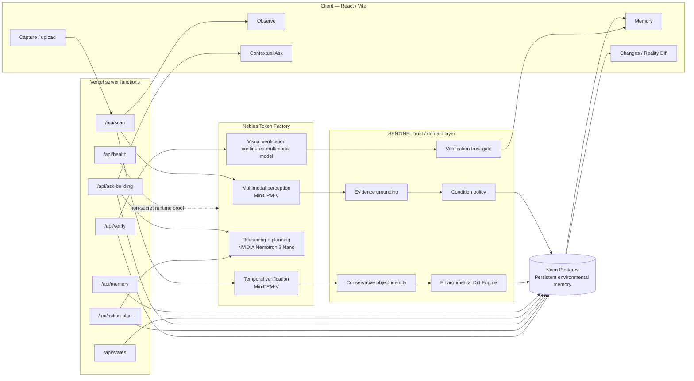
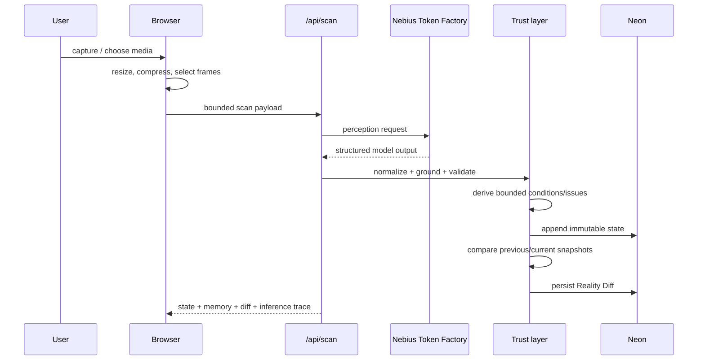

# SENTINEL Architecture

## System thesis

SENTINEL is a **persistent environmental-memory system**, not a one-shot image analyser.

A new observation is useful only when it can become a grounded immutable state that can later be queried, compared, acted on, and verified.

## High-level architecture



## Runtime roles

SENTINEL uses Nebius Token Factory as the inference runtime. Model output is never treated as authoritative by itself.

| Role | Responsibility | Default model | Deterministic controls around it |
| --- | --- | --- | --- |
| `perception` | Scene/object/condition/evidence extraction | `openbmb/MiniCPM-V-4_5` | schema validation, trusted frame grounding, retry, condition policy |
| `temporal-verification` | Same-object state/movement check across two images | `openbmb/MiniCPM-V-4_5` | conservative identity candidates, candidate-only output |
| `reasoning` | Ask the Building | `nvidia/NVIDIA-Nemotron-3-Nano-30B-A3B` | bounded memory context, reference filtering, confidence cap |
| `action` | Recommended action planning | `nvidia/NVIDIA-Nemotron-3-Nano-30B-A3B` | server-owned IDs, priority caps, evidence requirement |
| `verification` | Decide resolved/remaining/inconclusive from old/current visual context | configured verification model | positive-current-evidence rule, same-object/area validation, fail-closed status |

## Environmental memory model

A physical location owns an environmental memory aggregate.

```text
Environment
├── State v1
│   └── immutable snapshot
├── State v2
│   └── immutable snapshot
├── State v3
│   └── immutable snapshot
├── evidence
├── observations
├── current canonical objects
├── conditions
├── issues
├── relations
└── persisted Reality Diffs
```

Every state records references to its source/evidence and retains its own snapshot. Later updates do not rewrite what an older state believed.

## Observation pipeline



### Trust boundary

The provider can propose observations, objects, conditions and relations. SENTINEL owns:

- scan/environment identity;
- trusted evidence frames;
- schema validation;
- unknown-reference removal;
- issue promotion thresholds;
- object identity matching;
- state immutability;
- Reality Diff semantics;
- verification outcome aggregation.

## Ask the Building

Ask is not a free-form chatbot over arbitrary context.

The server selects:

- requested/current immutable state;
- bounded earlier state history;
- relevant objects;
- relations;
- conditions;
- issues;
- evidence;
- prior Reality Diffs.

The model receives only that context. Returned object/evidence/issue IDs are filtered back through the server-owned envelope.

If no cited evidence survives, confidence is capped rather than silently trusting the generated answer.

## Action Planner

Action Planner is recommendation-only.

It cannot mark a physical action completed. It receives a selected immutable state and grounded condition/issue references, then returns 1–3 proposed steps. SENTINEL:

- drops unsupported IDs;
- requires evidence;
- caps priority to condition/issue authority;
- appends **Rescan to verify** deterministically.

No contractor marketplace, procurement, payment, or autonomous physical execution is part of the MVP.

## Verification

Verification is the closed-loop trust layer.

```text
Earlier condition
      ↓
recommended action
      ↓
new observation
      ↓
new immutable state
      ↓
Reality Diff
      ↓
paired visual localization
      ↓
Verification Agent
      ↓
resolved / remaining / inconclusive
```

Baseline imagery may localize where a condition existed. It **cannot** prove resolution.

Only positive current evidence can support `resolved` or `remaining`.

> **Not re-observed is not resolved.**

## Reliability

SENTINEL has deterministic regression coverage for:

- poor visual input;
- duplicate frames;
- provider timeout/retry;
- malformed provider output;
- missing evidence references;
- immutable-history retrieval;
- concurrent state writes;
- object identity;
- no-material-change results;
- missing environments/states/snapshots;
- request-size limits;
- browser network failures;
- semantic duplicate conditions;
- contradictory verification verdicts;
- production cold-start restoration.

## Runtime proof

Each Token Factory completion records a non-secret trace:

```json
{
  "provider": "nebius-token-factory",
  "model": "nvidia/NVIDIA-Nemotron-3-Nano-30B-A3B",
  "role": "reasoning",
  "latencyMs": 15904,
  "outcome": "success",
  "completedAt": "...",
  "httpStatus": 200
}
```

The example latency above is from the exact-main Phase 16 production proof. No API key, prompt, image, or evidence body is included in the trace.

## Deployment

```text
Browser
  ↓
Vercel-hosted React app + server functions
  ↓
Nebius Token Factory — inference
  ↓
SENTINEL trust/domain layer
  ↓
Neon Postgres — durable environmental memory
```

Production: https://sentinel-physical-memory.vercel.app
